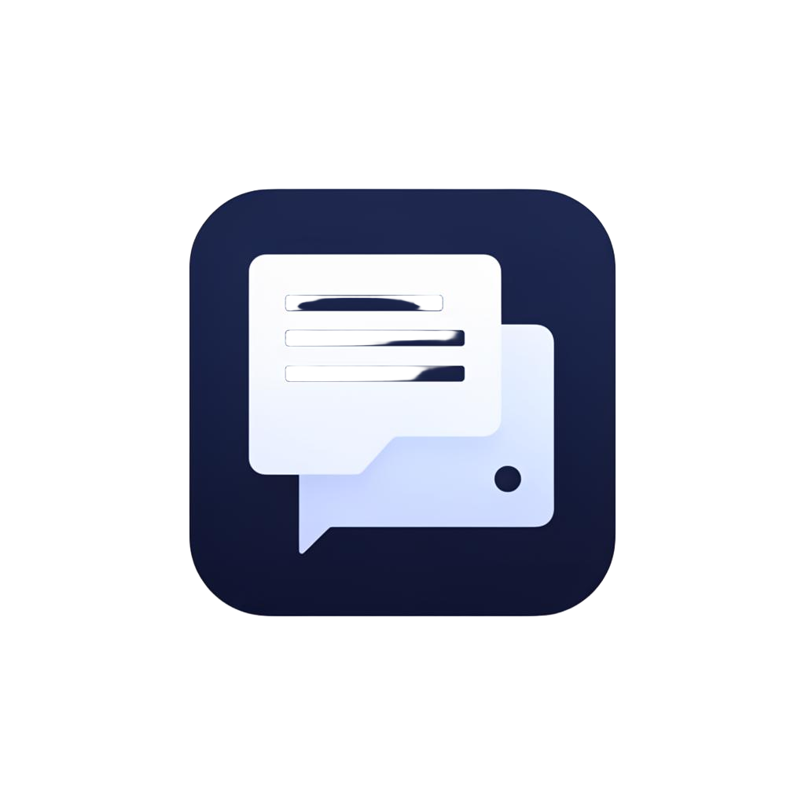

<p align="center">
  
</p>

<h1 align="center">WebConsoleCapture</h1>

<p align="center">
  <strong>Capture console logs from any web UI - via Chrome DevTools Protocol or screen OCR.</strong>
</p>

<p align="center">
  <a href="#features">Features</a> &middot;
  <a href="#install">Install</a> &middot;
  <a href="#quick-start">Quick start</a> &middot;
  <a href="#build-a-portable-exe">Build EXE</a> &middot;
  <a href="docs/USAGE.md">Usage</a> &middot;
  <a href="docs/ARCHITECTURE.md">Architecture</a>
</p>

<p align="center">
  
  
  
  
</p>

---

## What is it?

**WebConsoleCapture** is a desktop tool that records live console / log output
from *any* web UI to a file in real time. It connects to Chrome through the
[Chrome DevTools Protocol](https://chromedevtools.github.io/devtools-protocol/)
(CDP) for fast, exact text, or it can OCR a region of your screen when CDP
isn't an option (Electron apps, native consoles, restricted browsers, etc.).

It was originally built for a humanoid-robot research project at BTU
Cottbus - Senftenberg, and has been generalised into a tool that works for
any web app whose console you need to archive: dashboards, dev tools,
LLM/chat UIs, instrumentation panels, monitoring views, kiosk apps, you name
it.

## Features

- **Two capture engines**
  - *CDP*: attaches to a Chrome tab and streams `console.*` plus optional
    DOM mutations from any CSS selector via an injected `MutationObserver`.
  - *OCR*: drag a rectangle anywhere on screen; only changed frames are
    OCR'd (CPU-only via `rapidocr-onnxruntime`, no Tesseract install).
- **Click-to-pick** a DOM element inside the live page, with an iframe-aware
  selector resolver and a `Test selector` preview.
- **Resilient streaming** - auto-reconnect with exponential backoff and a
  visible retry countdown.
- **Live status banner** - state, observer fires, events/sec, last event age.
- **Professional sidebar UI** - Source / Capture / Diagnostics pages, sticky
  Start/Stop/Export bar, scroll-safe layout that stays compact.
- **Timestamped log file** + **CSV export**.
- **Windows 11 Mica** glassy theme; clean Fusion dark theme everywhere else.
- **One-click portable EXE** via PyInstaller (`BUILD_EXE.bat`).

## Screenshots

> Drop screenshots into `docs/screenshots/` and reference them here.

```
docs/screenshots/main.png        # main window with sidebar
docs/screenshots/diagnostics.png # diagnostics page
```

## Install

### Prerequisites

- Python 3.10 or newer
- Google Chrome (for CDP mode)

### From source

```bash
git clone https://github.com/AminAdinehAhari/WebConsoleCapture.git
cd WebConsoleCapture
python -m venv .venv
.venv\Scripts\activate           # Windows
# source .venv/bin/activate      # macOS / Linux
pip install -r requirements.txt
python -m app
```

On Windows you can also double-click `run.bat`.

## Quick start

### CDP mode (recommended)

1. Close any existing Chrome windows (Chrome ignores the debug flag if a
   profile is already in use).
2. In the app, open the **Source** page and click **Launch Chrome**.
3. Open the web UI you want to capture inside that Chrome window.
4. Click **Refresh tabs**, pick your tab, then **Test CDP connection**.
5. *(Optional)* Click **Pick on page...** and click a specific panel to
   narrow capture to that DOM region.
6. Open the **Capture** page, choose a log file, and click **Start capture**
   at the bottom.

### OCR mode

1. On the **Source** page, switch **Capture mode** to *Screen region (OCR)*.
2. Click **Pick screen region...** and drag a rectangle.
3. Click **Start capture**.

## Build a portable EXE

A one-file Windows EXE that anyone can double-click:

```bat
BUILD_EXE.bat
```

Output: `dist\WebConsoleCapture.exe` (~ 60-120 MB depending on enabled OCR).

For other platforms, run PyInstaller manually with the same flags as in
`BUILD_EXE.bat`.

## Companion app

If you also need to extract structured conversational turns out of the
captured log, see the standalone **[DialogFilter](../DialogFilter)** app
that tails `console_log.txt` and writes a clean `dialog_filter.txt` (and
CSV / JSON / Markdown).

## Documentation

- [Usage guide](docs/USAGE.md)
- [Architecture](docs/ARCHITECTURE.md)
- [Build & packaging](docs/BUILDING.md)

## Author

**Amin Adineh** - Brandenburg University of Technology
- GitHub: [@AminAdinehAhari](https://github.com/AminAdinehAhari)

## License

Released under the [MIT License](LICENSE).
